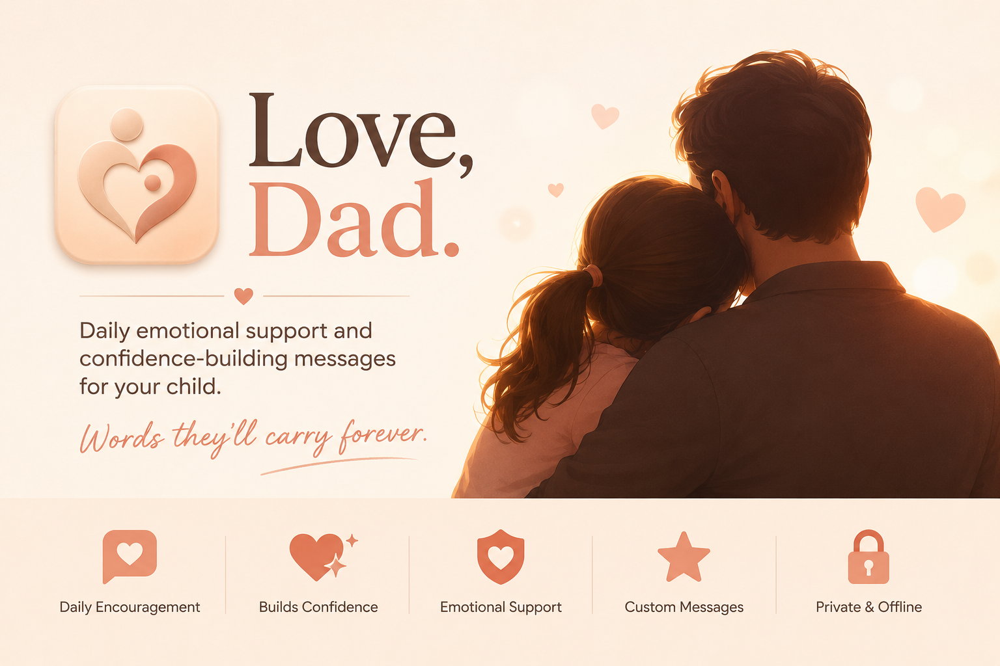

# Love, Dad.

**Daily emotional support and confidence-building messages for your child.**

> *For the days they need to hear it.*

     

---

## 🚀 About Love, Dad.

**Love, Dad.** is a warm, modern, single-file web app designed to help parents encourage, comfort, and strengthen their children through loving words.

It's more than a quote generator. It's a daily emotional support companion that helps children feel loved, safe, appreciated, understood, and capable.

The app offers two experiences:

- **Child Mode** — open the app and instantly receive love, encouragement, affirmations, and wisdom.
- **Parent Mode** — create, customize, save, and manage messages for your child.

Everything is private and offline-first. No accounts. No backend. No tracking. Just love, from you to them.

---

## 🌟 Features

### 🏠 Today (Child Mode)

- Warm greeting using the child's name.
- Daily love notes and encouragement.
- Strength reminders and wisdom.
- 16 message categories (Morning, Night, Love, Proud, Confidence, Hard Day, Mistake, School, Friends, Worry, Courage, Sad, Angry, Lonely, Birthday, Random).
- Feeling selector for difficult emotions (Sad, Angry, Worried, Lonely, Scared, Left Out, Not Good Enough, I Messed Up).
- Structured responses with validation, grounding, love, and next steps.
- Generate, copy, share, or favorite messages.

### ✏️ Create (Parent Mode)

- Generate messages by category and tone (short, sweet, deep, gentle, strong, funny, fatherly, motherly, neutral).
- Edit messages before sharing.
- Create custom messages with title, category, tone, and intended use (Child, Parent, or Both).
- Custom messages appear alongside built‑in ones.

### ⭐ Saved

- Beautiful card-based favorites.
- Copy or remove saved messages with one tap.

### ⚙️ Parent

- Personalize child's name, parent's name, and relationship (Dad, Mom, Parent, Grandma, Grandpa, Guardian).
- Export and import full data backups as JSON.
- Clear all data with confirmation.
- Quick access to support and source code.

---

## 🛠️ Tech Stack

- **Alpine.js** — lightweight reactive framework for all interactivity.
- **Tailwind CSS** — responsive utility-first styling.
- **LocalStorage API** — offline-first data persistence.
- **Web Share API** — native sharing support.
- **Clipboard API** — copy messages instantly.

---

## 📥 Installation & Setup

**Love, Dad.** is a single HTML file – no installation required.  
To run it:

1. **Download** the `index.html` file from the repository.
2. **Open** it in any modern browser (Chrome, Firefox, Safari, Edge).
3. That's it! All data stays in your browser's localStorage.

For local development, you can use any static server:

    python3 -m http.server 8000
    # Then open http://localhost:8000

---

## 💾 Data Privacy & Persistence

All data is stored **exclusively** in your browser's `localStorage` under separate keys (`loveDad_childName`, `loveDad_favorites`, `loveDad_customMessages`, etc.). This means:

- ✅ **No accounts** – no sign‑ups, no logins.
- ✅ **No data leaves your device** – no server, no tracking, no analytics.
- ✅ **Works completely offline** – once loaded, the app runs without internet.
- ✅ **You own your data** – use Export to create backups or transfer to another device.

---

## 📊 How It Works

The app is built around a single Alpine.js component (`app()`) that holds all state and methods. Here's a high‑level overview:

| Tab | Core Logic |
|-----|------------|
| **Today** | Displays a random message from the selected category. The feeling selector replaces the main message with a structured response (validation, grounding, love, next step). |
| **Create** | Generates a message by combining built‑in messages with custom ones (filtered by category and tone). The edit box allows live tweaking. |
| **Saved** | Renders the favorites array in reverse chronological order. Each item can be copied or removed. |
| **Parent** | Manages child/parent names, relationship, exports/imports the full state, and clears data. Custom messages are stored separately and merged into the message pool. |

All messages are stored as plain arrays (250+ built‑in messages spread across 16 categories). Custom messages are saved in their own array and merged during generation.

---

## 🤝 Want to Contribute?

Absolutely! **Love, Dad.** is open‑source and welcomes contributions. Here's how you can help:

- **Submit a Pull Request** – fix a bug, add a new feature, improve the design.
- **Share the app** – tell other parents about it.
- **Fork and experiment** – make it your own!

### Development Guidelines

1. Keep the **single‑file** structure – no build tools, no external dependencies beyond CDNs.
2. All state is managed inside the Alpine component (`app()`). Extend it by adding new data properties and methods.
3. The UI is styled with Tailwind CSS – add utility classes directly in the HTML.
4. **Preserve privacy** – no tracking, no analytics, no external requests.
5. **Test on mobile** – the design is mobile‑first and should work beautifully on phones.

---

## 💖 Support Love, Dad.

If this app has been helpful to you, consider supporting its development:

- ☕ [Buy me a coffee](https://michaelsboost.com/donate)
- 🎨 [Grab some art prints](https://www.deviantart.com/michaelsboost)
- 👕 [Merch store](https://michaelsboost.com/merch)
- 📚 [Graphic Design Course](https://michaelsboost.com/graphicdesign)
- 💸 [Tip what it's worth to you](https://michaelsboost.com/donate)

Your support keeps the app free, open‑source, and continuously improving. 💛

---

## 📜 License

**Love, Dad.** is open‑source under the [MIT License](LICENSE).  
You are free to use, modify, and distribute it, provided the original copyright notice is retained.

---

## 📧 Contact

For questions, feedback, or collaboration, reach out to:

**Michael Schwartz**  
🌐 [michaelsboost.com](https://michaelsboost.com)  
🐦 [@michaelsboost](https://twitter.com/michaelsboost)

---

# ❤️ Love, Dad.

*"Words they'll carry forever."*
